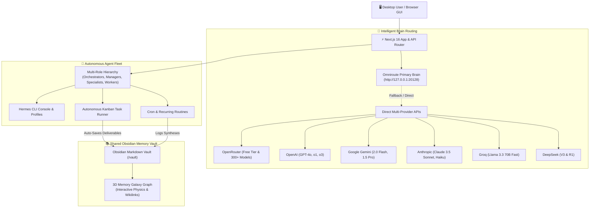

# 🌌 Agent Studio OS

> **Next-Generation Autonomous Multi-Agent Orchestration Operating System**  
> Build, coordinate, schedule, and interact with autonomous AI agents from a sleek desktop GUI powered by **Omniroute as the Primary Brain Gateway**, direct multi-provider API fallbacks, and a synchronized Obsidian-compatible shared memory vault.

---

## ⚡ Architecture Overview

Agent Studio OS unites local and cloud model providers, autonomous agents, and persistent markdown memory into a unified desktop cockpit.



---

## ✨ Key Features

### 🧠 1. Omniroute Primary Brain & Multi-API Router
- **Omniroute as Primary Brain**: Automatically prioritizes your local Omniroute model router (`http://127.0.0.1:20128`), supporting intelligent combo routing (`auto/best-coding`, `auto/fast`, `auto/smart`).
- **Resilient Multi-Provider Fallback**: Seamlessly cascades to direct cloud provider APIs when models are offline or rate-limited:
  - **OpenRouter**: Complete catalog access with instant free-tier models (`liquid/lfm-2.5-2.6b:free`, `google/gemini-2.0-flash-exp:free`, `meta-llama/llama-3.3-70b-instruct:free`).
  - **OpenAI**: Native direct access to GPT-4o, GPT-4o Mini, and reasoning models.
  - **Google Gemini**: High-speed multimodal completions via official OpenAI-compatible endpoints.
  - **Anthropic Claude**: Claude 3.5 Sonnet & Claude 3 Haiku for complex coding and synthesis.
  - **Groq, DeepSeek, & Mistral**: Ultra-low-latency inference engines.
- **Provider Hub & Key Testing**: Real-time ping testing and secure management for all credentials in Settings.

### 🤖 2. Autonomous Agent Studio & Hierarchy
- **Hierarchical Fleet Management**: Organize agents into structured tiers:
  - **Orchestrators**: High-level strategy and planning.
  - **Managers**: Project coordination, milestone tracking, and task delegation.
  - **Specialists**: Deep domain work (software engineering, market research, analysis).
  - **Workers**: Automated routines and scheduled executions.
- **Dual Visual Modes**: Seamlessly toggle between **Grid Card View** and **Visual Tree Hierarchy View**.
- **Unified Agent Form**: Create and edit agent avatars, personas, system prompts, default models, theme colors, and department assignments anytime.

### ⚡ 3. Hermes CLI Console
- **Interactive In-Browser Terminal**: Execute live Hermes CLI commands (`profile show`, `tools list`, `skills list`, `memory list`) directly inside the GUI.
- **Dedicated Profile Scoping**: Each terminal session automatically targets the selected agent's isolated Hermes profile environment.
- **Clean, Distraction-Free UI**: Purpose-built developer terminal with real-time execution logs, latency tracking, one-click copy, and instant clear.

### 📋 4. Autonomous Kanban Pipeline
- **Drag-and-Drop Task Management**: Move tasks through standard lifecycle stages: **Backlog → In Progress → Review → Done**.
- **One-Click Autonomous Execution**: Click `Run Task` to summon the assigned agent, execute the prompt through the Primary Brain, and automatically commit deliverables into the Obsidian Vault.
- **Agent Assignment & Filtering**: Filter board views by assigned agent and view priority badges with due dates.

### 🌌 5. Shared Memory Vault & 3D Knowledge Galaxy
- **Single Source of Truth**: All agent outputs, research summaries, and deliverables are written as clean Markdown notes into the `vault/` directory.
- **Obsidian Compatibility**: Open the vault in the desktop Obsidian app with bidirectional wikilink (`[[Note Name]]`) resolution.
- **3D Memory Galaxy**: Explore knowledge clusters, connection nodes, and memory volume in an interactive Three.js-style 3D cosmic graph.
- **Built-in Markdown Editor**: View, edit, format, and delete vault notes directly from the web interface.

### ⏰ 6. Scheduled Routines & Background Automation
- **Recurring & One-Time Routines**: Configure recurring daily routines (e.g. 09:00 AM market scan, 05:00 PM code audit) or one-time timed tasks.
- **Autonomous Execution**: Routines run through the agent fleet, logging results into shared memory and moving completed deliverables into Review on the Kanban board.
- **Quick-Start Templates**: Pre-configured routines for market scanning, code audits, and content creation.

### 💬 7. Interactive Agent Chat & Model Arena
- **Real-Time Dialogue**: Engage in structured conversations with specific agents using their custom system prompts.
- **Dynamic Source Badges**: See exactly which brain executed each reply (`🧠 Omniroute`, `🌐 OpenRouter`, `🤖 OpenAI`, `✨ Gemini`, `🔮 Anthropic`, `⚡ Groq`).
- **Model Comparison Arena**: Run side-by-side prompt benchmarks across 3 different models simultaneously to evaluate latency and quality.

---

## 🚀 Quickstart Guide

### Prerequisites
- **Node.js**: `v20.0.0` or higher
- **npm** or **pnpm**
- **Omniroute** (Recommended for Primary Brain):
  ```bash
  npm install -g omniroute
  omniroute
  ```

### Installation

1. **Clone the repository**:
   ```bash
   git clone https://github.com/your-username/agent-studio-os.git
   cd agent-studio-os
   ```

2. **Install dependencies**:
   ```bash
   npm install
   ```

3. **Initialize the SQLite database**:
   ```bash
   npx prisma db push
   ```

4. **Configure your environment**:
   Create a `.env.local` file in the project root:
   ```env
   # Omniroute Primary Brain (Running locally)
   OMNIROUTE_URL="http://127.0.0.1:20128"
   OMNIROUTE_API_KEY="your-omniroute-key"

   # Fallback & Direct Provider Keys (Optional)
   OPENROUTER_API_KEY="sk-or-v1-..."
   OPENAI_API_KEY="sk-..."
   GEMINI_API_KEY="..."
   ANTHROPIC_API_KEY="sk-ant-..."
   GROQ_API_KEY="gsk_..."
   ```

5. **Start the development server**:
   ```bash
   npm run dev
   ```

6. Open [http://localhost:3000](http://localhost:3000) in your browser.

---

## 🔑 Environment Variables Reference

| Variable | Required | Default | Description |
|---|---|---|---|
| `OMNIROUTE_URL` | No | `http://127.0.0.1:20128` | Local or remote Omniroute Gateway endpoint |
| `OMNIROUTE_API_KEY` | No | Auto-detected | Omniroute authentication bearer/API key |
| `OPENROUTER_API_KEY` | Recommended | — | OpenRouter key for access to 300+ models & free tier |
| `OPENAI_API_KEY` | Optional | — | Direct OpenAI API key |
| `GEMINI_API_KEY` | Optional | — | Google Gemini API key |
| `ANTHROPIC_API_KEY` | Optional | — | Anthropic Claude API key |
| `GROQ_API_KEY` | Optional | — | Groq ultra-fast inference key |
| `DEEPSEEK_API_KEY` | Optional | — | DeepSeek API key |
| `MISTRAL_API_KEY` | Optional | — | Mistral AI API key |

> **Note**: You can also enter and manage all API keys directly from the **Settings → Provider Hub** UI without restarting the server.

---

## 📁 Project Structure

```text
agent-studio-os/
├── prisma/
│   ├── schema.prisma         # SQLite database schema (Agents, Tasks, Routines, Logs)
│   └── agent-studio.db       # Local SQLite database
├── src/
│   ├── app/
│   │   ├── page.tsx          # Dashboard overview & activity feed
│   │   ├── agents/           # Agent fleet management & hierarchy views
│   │   ├── chat/             # Agent chat & 3-way model comparison arena
│   │   ├── kanban/           # Autonomous task Kanban board
│   │   ├── routines/         # Scheduled automation engine
│   │   ├── memory/           # Shared Obsidian memory & 3D Galaxy graph
│   │   ├── settings/         # Provider Hub, API keys & Model test suite
│   │   ├── api/              # Next.js API routes (chat, tasks, models, etc.)
│   │   ├── globals.css       # Design tokens & glassmorphism styling
│   │   └── layout.tsx        # Persistent shell with sidebar navigation
│   ├── components/
│   │   ├── agents/           # Agent cards, hierarchy tree, Hermes terminal
│   │   ├── memory/           # Memory Galaxy 3D interactive physics canvas
│   │   └── layout/           # Global collapsible navigation sidebar
│   ├── lib/
│   │   ├── llm-router.ts     # Primary Brain routing & multi-provider cascade
│   │   ├── omniroute.ts      # Omniroute gateway client & health checks
│   │   ├── hermes.ts         # Hermes Agent CLI subprocess bridge
│   │   ├── vault.ts          # Obsidian markdown vault synchronization
│   │   ├── scheduler.ts      # Background cron routine runner
│   │   └── prisma.ts         # Prisma client singleton
│   └── types/
│       └── index.ts          # TypeScript interfaces & system definitions
├── vault/                    # Real-time Obsidian shared memory markdown notes
└── README.md
```

---

## 📡 API Endpoints Reference

| Method | Endpoint | Description |
|---|---|---|
| `POST` | `/api/chat` | Execute chat completion with an agent via Omniroute / LLM router |
| `GET` | `/api/chat` | Retrieve persistent conversation history for an agent |
| `DELETE`| `/api/chat` | Clear conversation history for an agent |
| `GET` | `/api/models` | List all available models from Omniroute and verified providers |
| `POST` | `/api/models` | Test completion on a specific model ID |
| `GET` | `/api/providers` | Get status of all configured API keys |
| `POST` | `/api/providers` | Save, delete, or test credentials for any provider |
| `GET` | `/api/tasks` | List all tasks on the Kanban board |
| `POST` | `/api/tasks` | Create a new task in Backlog |
| `POST` | `/api/tasks/[id]/run` | Trigger autonomous agent execution of a task |
| `GET` | `/api/routines` | List all scheduled routines |
| `POST` | `/api/routines` | Create a recurring or one-time routine |
| `POST` | `/api/routines/[id]/trigger` | Manually trigger a routine execution |
| `GET` | `/api/vault` | Fetch vault file tree and graph connections |
| `POST` | `/api/vault` | Create or update a vault note, or open Obsidian |
| `GET` | `/api/dashboard` | Fetch aggregated dashboard metrics and activity log |

---

## 🛠️ Development & Build

```bash
# Run development server with Turbopack
npm run dev

# Type check codebase
npx tsc --noEmit

# Build production bundle
npm run build

# Start production server
npm run start
```

---

## 🛡️ License

MIT License. Crafted with precision for autonomous agent engineering.
